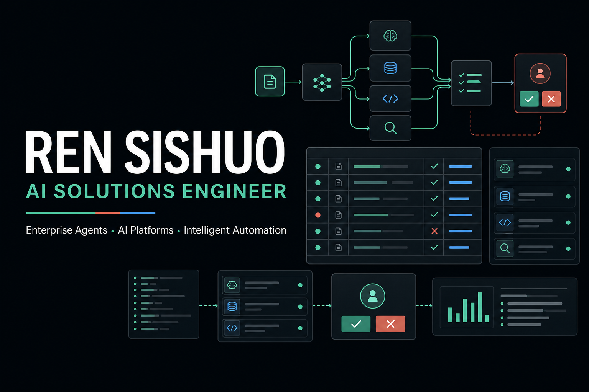

# Ren Sishuo — AI Solutions Portfolio

[portfolio.renss.top](https://portfolio.renss.top) is my English-first, bilingual portfolio for AI solution engineering and enterprise AI integration.



## What this site shows

- **ZR AI Gateway** — focused secondary development on New API and Sub2API, covering model access, user-owned keys, chat and image workflows.
- **Banking AI & Data Intelligence** — an anonymized enterprise case spanning agent workflows, code knowledge, test design and clustering analysis.
- **TileVision Studio** — a quality-gated spatial generation workflow.
- **RenoPilot** — a renovation operations and quote-readiness workbench.
- **YingQiao Flow** — a source-aware, compliance-gated content production pipeline.

Every featured project has a shareable case-study route, bilingual content and a keyboard-accessible full-resolution image viewer.

## Stack

- Next.js App Router through [vinext](https://github.com/cloudflare/vinext)
- React 19 and TypeScript
- Cloudflare Workers runtime
- Lucide interface icons
- Plain CSS with responsive desktop and mobile layouts

## Run locally

Requirements: Node.js 22.13 or newer.

```bash
npm install
npm run dev
```

Open `http://localhost:3000`.

## Validate

```bash
npm run lint
npm test
```

`npm test` builds the Cloudflare-compatible output and verifies the home page, all five case-study routes, bilingual project data, metadata and the zoomable-media contract.

## Content and privacy

Client-sensitive work is anonymized. Production repositories, credentials, internal paths, customer data and signed-in chat history are intentionally excluded. Public code links point only to separate sanitized showcase repositories.

ZR AI Gateway builds on these upstream projects and preserves their attribution:

- [QuantumNous/new-api](https://github.com/QuantumNous/new-api)
- [Wei-Shaw/sub2api](https://github.com/Wei-Shaw/sub2api)

## 中文说明

这是任思硕的 AI 解决方案工程师作品集。网站默认英文，支持中文切换并记忆语言选择；企业项目均已匿名化，公开仓库不包含生产代码、密钥、客户数据或登录后的会话信息。

## License

Source code is available under the MIT License. Personal copy, project screenshots and generated brand imagery remain © Ren Sishuo and are not included in that license.
